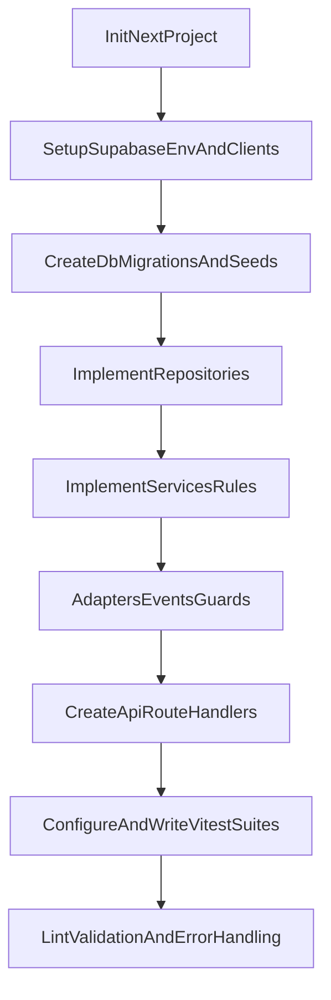

# Plano de implementação: Next + API + Supabase + Testes

## Objetivo imediato

Subir a base do MVP backend-first em Next.js com App Router, implementando autenticação Google via Supabase, domínio inicial de produtos/pedidos por camadas (services/repositories/adapters/events/guards), banco versionado com migrations/seeds e suíte de testes automatizados.

## Escopo desta fase (sem telas)

- Criar apenas rotas de API (`/app/api/...`) e estrutura de domínio.
- Não criar páginas visuais de loja/admin neste ciclo.
- Garantir contratos e regras de negócio por testes antes de evoluir UI.

## Estrutura inicial do projeto

- Inicializar Next.js (TypeScript, App Router, ESLint).
- Criar a estrutura base conforme arquitetura:
  - `[d:/Clientes/Christine/SOLAH/lib/services](d:/Clientes/Christine/SOLAH/lib/services)`
  - `[d:/Clientes/Christine/SOLAH/lib/repositories](d:/Clientes/Christine/SOLAH/lib/repositories)`
  - `[d:/Clientes/Christine/SOLAH/lib/adapters](d:/Clientes/Christine/SOLAH/lib/adapters)`
  - `[d:/Clientes/Christine/SOLAH/lib/events](d:/Clientes/Christine/SOLAH/lib/events)`
  - `[d:/Clientes/Christine/SOLAH/lib/factories](d:/Clientes/Christine/SOLAH/lib/factories)`
  - `[d:/Clientes/Christine/SOLAH/lib/guards](d:/Clientes/Christine/SOLAH/lib/guards)`
  - `[d:/Clientes/Christine/SOLAH/types](d:/Clientes/Christine/SOLAH/types)`
  - `[d:/Clientes/Christine/SOLAH/app/api](d:/Clientes/Christine/SOLAH/app/api)`

## Supabase e ambiente

- Adicionar SDK Supabase (client server-side e client com sessão quando necessário).
- Configurar variáveis de ambiente para URL/keys e OAuth Google.
- Definir utilitários em `[d:/Clientes/Christine/SOLAH/lib/supabase](d:/Clientes/Christine/SOLAH/lib/supabase)` para centralizar criação de clients.

## Banco de dados (migrations + seeds)

- Criar estrutura Supabase local em `[d:/Clientes/Christine/SOLAH/supabase](d:/Clientes/Christine/SOLAH/supabase)`.
- Criar migrations para tabelas do documento:
  - `products`, `product_images`, `orders`, `order_items`, `users`.
- Modelar constraints essenciais:
  - FK entre entidades.
  - ordem de imagens por `position`.
  - status de pedido com domínio controlado.
  - `order_items.price` obrigatório como snapshot do preço no momento da compra.
  - mecanismo de idempotência para criação de pedido (`idempotency_key`/`client_token` único por tentativa lógica).
- Criar seed mínimo para testes de integração (produtos e imagens).

## Segurança de dados (RLS + autorização)

- Implementar RLS nas tabelas de pedidos/itens para que:
  - usuário autenticado acesse somente seus próprios pedidos.
  - admin tenha acesso total.
- Não confiar em role enviada pelo client.
- Validar role sempre no server (guard + lookup de role confiável) antes de qualquer operação administrativa.

## Implementação backend por camadas

- Repositories:
  - `product.repository` (CRUD + `getProductWithImages`).
  - `order.repository` (criação de pedido + itens + atualização de status + controle de idempotência).
- Services:
  - `product.service` (regra de 1+ imagens por produto).
  - `order.service` (recalcular total no backend, iniciar em `aguardando_pagamento`, gravar snapshot de preço em itens e nunca depender de preço atual depois do fechamento).
- Adapters:
  - `whatsapp.adapter` (geração de link de comprovante).
  - `email.adapter` (contrato inicial e stub para eventos).
- Events:
  - `order.events` (`onOrderCreated`, `onPaymentConfirmed`, `onOrderShipped`).
- Guards:
  - `auth.guard` para admin em endpoints administrativos, com validação server-side de role.
- Observabilidade:
  - logging básico nos services críticos de pedidos (criação, idempotência aplicada, transição de status, erro de validação/autorização).

## Endpoints API iniciais

- Produtos:
  - `GET /api/products`
  - `GET /api/products/:id`
  - `POST /api/admin/products` (admin)
  - `PATCH /api/admin/products/:id` (admin)
- Pedidos:
  - `POST /api/orders` (criação + itens + total server-side + link WhatsApp)
  - `PATCH /api/admin/orders/:id/status` (admin)
  - `PATCH /api/admin/orders/:id/tracking` (admin, define tracking e status `enviado`)
- Auth:
  - endpoint utilitário para fluxo Google/Supabase e leitura de sessão em contexto server.
- Requisito transversal:
  - todas as entradas de API validadas com schemas Zod (params, query e body).

## Testes com Vitest

- Configurar Vitest + cobertura + ambiente para testar handlers/services.
- Priorizar testes em camadas:
  - Unitários de services (regras de negócio e validações).
  - Unitários de adapters (link WhatsApp).
  - Integração de repositories com banco de teste.
  - Integração de endpoints críticos (`POST /orders`, `POST /admin/products`).
- Cobrir cenários obrigatórios:
  - `order_items.price` preserva snapshot mesmo se preço do produto mudar depois.
  - criação de pedido idempotente com mesmo token/hash.
  - rotas admin bloqueiam usuário não-admin mesmo com payload/client adulterado.
  - rejeição de payload inválido por Zod em todas as rotas.
  - RLS impede leitura de pedidos de outro usuário.
- Criar dados de teste consistentes com seeds/mocks.

## Qualidade e segurança mínima

- Padronizar tratamento de erro e payloads HTTP.
- Validar input de endpoints com Zod (schema validation estrita).
- Garantir que UI não acesse banco diretamente; apenas API/services.
- Verificar lint e execução de testes em pipeline local.
- Verificar logs mínimos de auditoria técnica nos fluxos críticos de pedido.

## Sequência sugerida de execução

## Critérios de pronto desta fase

- Projeto Next inicializado e rodando com API handlers.
- Supabase integrado com migrations/seeds aplicáveis.
- Fluxo mínimo de produtos/pedidos funcional via API.
- Snapshot de preço em `order_items` implementado e testado.
- Idempotência de criação de pedidos implementada e testada.
- Validação Zod aplicada em todas as entradas de API.
- RLS ativo para isolamento de pedidos por usuário + acesso total admin.
- Validação de role feita no server em todas as operações admin.
- Logging básico ativo nos services críticos de pedidos.
- Regras críticas cobertas por testes Vitest.
- Nenhuma tela criada neste ciclo, por decisão de escopo.

